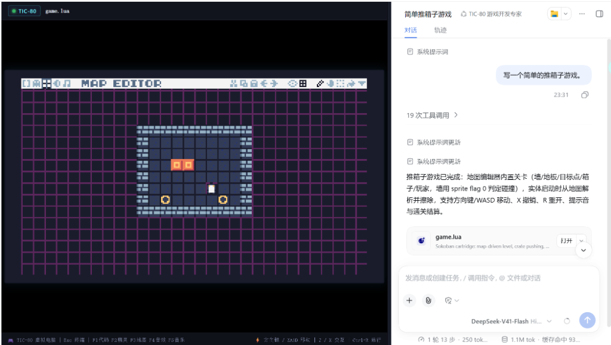

# dsh-plugin-tic80

[](https://www.npmjs.com/package/dsh-plugin-tic80)
[](LICENSE)
[](https://github.com/deepseek-ai/deepseek-harness)
[](https://github.com/topics/dsh-plugin)

[中文文档](README.zh.md) | English

**dsh-plugin-tic80** is a full-featured **TIC-80 fantasy computer plugin** engineered specifically for **DeepSeek Harness (dsh)**. Explore more ecosystem plugins under the [`dsh-plugin`](https://github.com/topics/dsh-plugin) topic.

It preserves 100% of TIC-80's official console capabilities while enabling conversational AI workflows where LLM agents can write **game code, tracker music, world maps, sound effects, and sprite pixel art**, running and testing games with live hot-reload in real-time.

<p align="center">
  
</p>

---

## 🌟 Key Features

- 🎮 **Full TIC-80 Capabilities**:
  - 240×136 retro resolution, 16-color customizable palette.
  - Complete dual-bank architecture: Bank 0 (256 background Tiles) + Bank 1 (256 foreground Sprites), supporting multi-tile sprites (16×16, 24×24, 32×32) and 8-bit collision/interaction flags.
  - 240×136 world map (32,640 tiles total).
  - 4-channel chiptune tracker (64 patterns, 64 tracks, tempo & speed controls).
  - 64 sound effects (SFX) with 30-note envelopes, arpeggios, and 16 custom waveforms.
  - Lossless bidirectional conversion between `.lua` text carts and official `.tic` binary ROMs.
- 💬 **Conversational Game Development**:
  - Exposes 13 typed model tools (`dsh-tools`), allowing LLMs to design level maps, write Lua scripts, generate ASCII pixel art, synthesize retro sound effects, and arrange music through natural language.
  - Built-in static Linter checking Lua syntax, `TIC()` entrypoint, 512KB memory budget, and sandbox safety.
- 🚀 **Embedded Web UI & Real-Time Hot-Reload**:
  - **DSH Embedded 3-Column Studio**: TIC-80 virtual game console is embedded directly into the DeepSeek Harness Web UI (Left: DSH sidebar, **Middle: TIC-80 Console Screen**, Right: AI Chat), providing an all-in-one game dev environment.
  - **Turn-1 Ready Blank Cartridge**: Pre-seeded with `cartridge/game.lua` and fully injected into the System Prompt. The LLM starts generating game logic and assets in Turn 1 without wasting turns re-creating cartridges.
  - **Official TIC-80 WebAssembly Engine & Studio**: Powered by the genuine official TIC-80 WebAssembly console (Emscripten / SDL2). Preserves the authentic retro CRT interface style, complete CLI command terminal, and built-in F1-F5 sub-editors (`F1` Code, `F2` Sprites, `F3` World Map, `F4` SFX, `F5` Music Tracker, `Ctrl+R` Run, `Esc` Console).
  - **Live Web Hot-Reload**: Real-time WebSocket synchronization. Tool edits made by the LLM update the middle-column TIC-80 screen immediately.
  - **Native Desktop Runner**: Headless CLI execution and desktop window integration with official `tic80.exe`.
- 📦 **Multi-format Exporters**:
  - One-click export to `.lua` source carts, `.tic` binary ROMs, and standalone playable `.html` web games.
- 🕹️ **Pre-built Templates**:
  - `minimal`, `platformer`, `sokoban`, `rpg`, and `shmup`.

---

## 📦 Installation & Setup

### Using in DeepSeek Harness

Add the plugin to your `cordis.yml` or `cordis.patch.yml`:

```yaml
- id: tic80
  name: 'dsh-plugin-tic80'
  config:
    defaultTemplate: minimal   # Options: minimal, platformer, sokoban, rpg, shmup
    autoRun: true              # Auto-start Web Live Studio
    webStudioPort: 3088        # Web preview port
    cartFilePath: './cart.lua' # Bind local cartridge file
```

Launch via dsh CLI:

```bash
dsh --profile web --patch ./cordis.patch.yml
```

### Standalone Usage

```bash
npm install dsh-plugin-tic80
```

```typescript
import { Context } from '@deepseek-ai/cordis';
import * as Tic80Plugin from 'dsh-plugin-tic80';

const ctx = new Context();
ctx.plugin(Tic80Plugin, {
  defaultTemplate: 'platformer',
  autoRun: true,
  webStudioPort: 3088,
});
```

---

## 🛠️ DSH Tools Overview

| Tool Name | Description |
| :--- | :--- |
| `tic80_init` | Initialize a cartridge project from genre templates |
| `tic80_get_cart` | Inspect cartridge code, sprites, map regions, or audio state |
| `tic80_set_code` | Update game code (Lua/JS) with validation and hot-reload |
| `tic80_edit_sprite` | Draw 8×8 or multi-tile sprites using ASCII art (e.g. `.` transparent, `0`-`f` colors) |
| `tic80_batch_sprites` | Batch define animation frames and tilesets |
| `tic80_edit_map` | Place tiles, fill areas, or load ASCII map diagrams on the 240×136 grid |
| `tic80_create_sfx` | Synthesize sound effects using presets (jump/coin/laser/etc.) or custom notes |
| `tic80_compose_music` | Compose 4-channel retro chiptune patterns and chain into tracks |
| `tic80_set_palette` | Switch 16-color palettes (Sweetie-16, PICO-8, DB16, GameBoy, Cyberpunk) |
| `tic80_validate` | Perform static checks on cartridge limits, syntax, and API usage |
| `tic80_run` | Launch Web Live Studio (with live hot reload) or native `tic80.exe` |
| `tic80_export` | Export cartridge as `.lua`, `.tic`, or standalone `.html` |
| `tic80_studio_status` | Query live studio status, connected players, and logs |

---

## 🧪 Automated Testing

Run the full test suite (100% passing across all modules):

```bash
npm test
```

---

## 📄 License

[MIT License](LICENSE) © 2026 NoodleStormno
